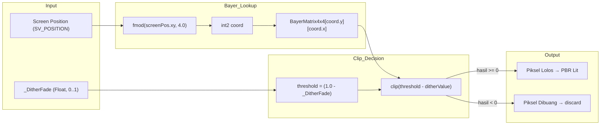

# Dithered Alpha Clipping — Shader Graph Design Document

> Dokumen ini menjelaskan arsitektur dan rancangan node graph dari shader `FarmBeware/Building/DitheredBuildingLit` yang digunakan untuk transparansi dinding dan atap bangunan. Shader ini diimplementasikan dalam HLSL murni (bukan visual Shader Graph), namun dokumen ini menyajikan rancangan logika sebagai referensi visual berbasis node graph agar mudah dipahami oleh Technical Artist.

---

## 1. Prinsip Fundamental

### Mengapa BUKAN Alpha Blending Tradisional?

| Aspek | Alpha Blended (`Transparent`) | **Dithered Alpha Clipping (Kami)** |
|---|---|---|
| `RenderType` | `Transparent` | **`Opaque`** |
| `ZWrite` | Off ❌ | **On ✓** |
| Render Queue | 3000+ (transparan) | **2000 (Geometry)** |
| Depth Buffer | Rusak — sorting Z gagal | **Utuh — Z-test akurat** |
| Shadow Casting | Tidak bisa ❌ | **Bisa ✓** (ShadowCaster pass) |
| GPU Resident Drawer | Pecah (tidak di-batch) | **Kompatibel ✓** (tetap Opaque) |
| Sorting Error | Furnitur/karakter z-fight | **Tidak ada masalah** |

> [!CAUTION]
> **DILARANG KERAS** menggunakan `Surface Type = Transparent` pada material bangunan. Ini akan melumpuhkan depth buffer, shadow map, dan GPU batching secara sekaligus.

---

## 2. Matriks Bayer 4×4

Matriks threshold dither standar berukuran 4×4, dinormalisasi ke rentang `[0, 1)`:

```
┌────────────────────────────────────────────┐
│  0/16   8/16   2/16  10/16  │  0.000  0.500  0.125  0.625 │
│ 12/16   4/16  14/16   6/16  │  0.750  0.250  0.875  0.375 │
│  3/16  11/16   1/16   9/16  │  0.188  0.688  0.063  0.563 │
│ 15/16   7/16  13/16   5/16  │  0.938  0.438  0.813  0.313 │
└────────────────────────────────────────────┘
```

Setiap piksel layar dipetakan ke salah satu dari 16 sel berdasarkan `fmod(screenPos.xy, 4.0)`. Nilai threshold dari sel tersebut dibandingkan dengan parameter `_DitherFade` untuk menentukan apakah piksel dibuang (`clip()`) atau lolos.

---

## 3. Rancangan Node Graph (Logika Shader)

Berikut adalah representasi logika shader sebagai diagram node graph:



### Alur Detail:
1. **Screen Position** → Ambil koordinat piksel dari `SV_POSITION`
2. **Modulo 4** → `fmod(abs(screenPos.xy), 4.0)` untuk mendapatkan index 0–3
3. **Bayer Lookup** → Ambil threshold dari `BayerMatrix4x4[y][x]`
4. **Threshold Calculation** → Hitung `(1.0 - _DitherFade)` sebagai batas clipping
5. **Clip Decision** → `clip(threshold - ditherValue)`:
   - Jika `threshold >= ditherValue` → piksel **lolos** → render normal
   - Jika `threshold < ditherValue` → piksel **dibuang** → `discard`

---

## 4. Perilaku Visual per Nilai `_DitherFade`

| `_DitherFade` | Piksel Lolos | Deskripsi Visual |
|---|---|---|
| `0.00` | 16/16 (100%) | Solid penuh — dinding/atap tampak normal |
| `0.25` | 12/16 (75%) | Sedikit tembus — pola grid sangat tipis |
| `0.50` | 8/16 (50%) | Setengah tembus — pola checkerboard jelas |
| `0.75` | 4/16 (25%) | Sangat tembus — hanya sisa garis samar |
| `0.85` | 2/16 (12.5%) | **Rekomendasi untuk gameplay** — interior terlihat jelas |
| `1.00` | 0/16 (0%) | Tembus pandang penuh — seluruh piksel dibuang |

---

## 5. Konsistensi Shadow Pass

> [!IMPORTANT]
> Fungsi `ApplyBayerDither()` yang **IDENTIK** diterapkan di semua pass shader:
> - `ForwardLit` — Rendering visual utama
> - `ShadowCaster` — Generasi shadow map
> - `DepthOnly` — Depth prepass
> - `DepthNormals` — SSAO dan efek screen-space

Ini memastikan bahwa saat atap di-dither transparan untuk kamera (pemain melihat ke dalam rumah), bayangan siluet fasad bangunan **tetap terpancar ke pekarangan luar** dengan konsistensi penuh.

```
Kamera melihat:          Shadow map melihat:
┌─────────────┐          ┌─────────────┐
│ ░░ Atap ░░  │          │ ░░ Atap ░░  │   ← Pola dither IDENTIK
│   Interior  │          │   (shadow)  │
│  🪑  🛏️    │          │   ████████  │
│  Lantai     │          │   ████████  │
└─────────────┘          └─────────────┘
```

---

## 6. Properti Material (Inspector)

| Properti | Tipe | Default | Deskripsi |
|---|---|---|---|
| `_BaseColor` | Color | Putih | Warna dasar dinding/atap |
| `_BaseMap` | Texture2D | white | Tekstur albedo |
| `_Smoothness` | Float 0–1 | 0.3 | Kehalusan permukaan PBR |
| `_Metallic` | Float 0–1 | 0.0 | Metallic PBR |
| `_DitherFade` | Float 0–1 | 0.0 | **Kontrol transparansi dither** |
| `_BumpMap` | Texture2D | bump | Normal map |
| `_BumpScale` | Float 0–2 | 1.0 | Intensitas normal map |

---

## 7. Integrasi dengan Sistem Lain

### HouseInteriorTrigger.cs
- Menginterpolasi `_DitherFade` via `MaterialPropertyBlock`
- **Tidak** menginstansiasi material baru — aman untuk GPU Resident Drawer

### Kompatibilitas GPU Resident Drawer (BRG)
- Shader tetap pada `RenderType = Opaque` → di-batch oleh BRG
- `MaterialPropertyBlock` per-renderer → compatible dengan instancing
- `ZWrite On` → depth buffer tidak rusak

### URP Deferred+ Pipeline
- Menggunakan `Tags { "LightMode" = "UniversalForwardOnly" }` pada pass `ForwardLit`. Pada Deferred+, pass forward opaque hanya menerima `UniversalForwardOnly` (tag `UniversalForward` standar akan diabaikan oleh GBuffer pass).
- Semua pass yang diperlukan Deferred+ tersedia: ForwardLit (`UniversalForwardOnly`), DepthOnly (`DepthOnly`), DepthNormals (`DepthNormals`), ShadowCaster (`ShadowCaster`).
- Tidak ada konflik dengan GBuffer karena tetap Opaque.

---

## 8. Troubleshooting

| Masalah | Penyebab | Solusi |
|---|---|---|
| Dinding/atap tidak terlihat (tembus pandang total, hanya bayangan) | Pass shader menggunakan tag `UniversalForward` di Deferred+ | Gunakan `Tags { "LightMode" = "UniversalForwardOnly" }` agar dieksekusi oleh pass forward-only |
| Dinding tidak tembus meski `_DitherFade = 1` | Material tidak menggunakan shader ini | Ganti shader material ke `FarmBeware/Building/DitheredBuildingLit` |
| Pola dither tampak kasar / blocky | Resolusi rendah | Normal — pola 4×4 memang terlihat pada resolusi < 720p. Pertimbangkan matriks 8×8 untuk display 4K |
| Bayangan tidak ikut dither | Pass ShadowCaster tidak ada | Pastikan shader memiliki pass ShadowCaster dengan `ApplyBayerDither()` |
| Material di-batch terpisah | `MaterialPropertyBlock` berlebihan | Ini normal — setiap renderer dengan `_DitherFade` berbeda akan memiliki draw call terpisah |

