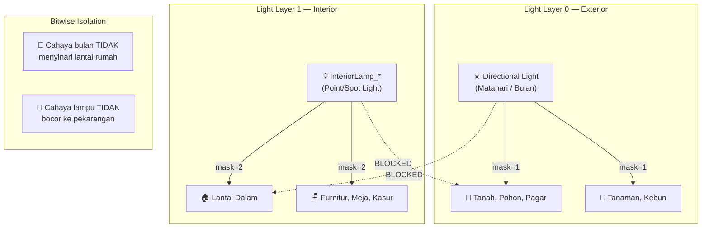

# Light Layers Segregation Guide — URP Interior/Exterior

> Panduan konfigurasi **URP Light Layers** untuk mencegah kebocoran cahaya (light leaking) antara eksterior dan interior bangunan pada proyek Farm-Beware.

---

## 1. Arsitektur Light Layers

### Definisi Layer

| Light Layer | Bit | Mask | Nama | Fungsi |
|---|---|---|---|---|
| **Layer 0** | Bit 0 | `1` | **Exterior** | Directional Light (matahari/bulan), ambient, objek outdoor |
| **Layer 1** | Bit 1 | `2` | **Interior** | Lampu rumah (Point/Spot), lantai dalam, furnitur |
| **Layer 0+1** | Bit 0+1 | `3` | **Transisi** | Objek ambang pintu, dinding luar yang perlu menerima kedua cahaya |

### Diagram Segregasi



---

## 2. Prasyarat: Aktivasi Light Layers di URP

> [!IMPORTANT]
> Light Layers **HARUS** diaktifkan secara eksplisit di URP Renderer Data. Tanpa ini, seluruh pengaturan `renderingLayerMask` tidak akan berpengaruh.

### Langkah Konfigurasi Editor

1. **Buka URP Renderer Data**:
   - Navigate ke `Assets/Settings/PC_Renderer.asset` di Project Window
   - Atau akses via menu: `Edit → Project Settings → Graphics → Scriptable Render Pipeline Settings → Renderer List`

2. **Aktifkan Light Layers**:
   ```
   PC_Renderer (UniversalRendererData)
   └── Rendering
       └── Use Light Layers → ✓ Enable
   ```

3. **Atur Nama Layer (Opsional tapi Direkomendasikan)**:
   ```
   PC_Renderer → Rendering → Light Layer Names
   ├── Layer 0: "Exterior"
   ├── Layer 1: "Interior"
   ├── Layer 2: "Underground" (reserved)
   └── Layer 3-7: (tidak digunakan)
   ```

---

## 3. Konfigurasi per Komponen

### 3.1 Directional Light (Matahari/Bulan) → Layer 0

```
Hierarchy: Directional Light (atau "Sun_Main")
└── Light Component
    └── General → Rendering Layer Mask
        ├── ☑ Layer 0 (Exterior)
        └── ☐ Layer 1 (Interior)   ← HAPUS centang ini!
```

> [!WARNING]
> Secara default, Directional Light menyinari SEMUA layer (mask = `0xFFFFFFFF`). Anda **HARUS** secara eksplisit mengubahnya ke **hanya Layer 0** agar cahaya bulan biru dingin tidak menodai interior.

### 3.2 Lampu Interior → Layer 1

Untuk setiap lampu di dalam rumah (`InteriorLamp_Ruangan`, `Light_Interior_Dapur`, dll.):

```
Hierarchy: InteriorLamp_LivingRoom
└── Light Component (Point / Spot)
    ├── Color: Warm Amber (1.0, 0.68, 0.32)
    ├── Intensity: 2.0 - 4.0
    └── General → Rendering Layer Mask
        ├── ☐ Layer 0 (Exterior)   ← HAPUS centang ini!
        └── ☑ Layer 1 (Interior)
```

### 3.3 MeshRenderer Geometri Indoor → Layer 1

Untuk lantai dalam, dinding dalam, furnitur:

```
Hierarchy: Floor_Interior_LivingRoom
└── Mesh Renderer
    └── Additional Settings → Rendering Layer Mask
        ├── ☐ Layer 0 (Exterior)
        └── ☑ Layer 1 (Interior)
```

### 3.4 MeshRenderer Geometri Outdoor → Layer 0 (Default)

Objek outdoor secara default sudah di Layer 0 (mask = `1`). Tidak perlu diubah kecuali jika sebelumnya pernah dikustomisasi.

### 3.5 Objek Transisi (Ambang Pintu) → Layer 0 + Layer 1

```
Hierarchy: Door_Frame_Main
└── Mesh Renderer
    └── Additional Settings → Rendering Layer Mask
        ├── ☑ Layer 0 (Exterior)
        └── ☑ Layer 1 (Interior)
```

---

## 4. Penggunaan Tool Otomatis

### 4.1 Buka Editor Window

```
Menu: Tools → Farm-Beware → Rendering → Light Layer Assignment Utility
```

### 4.2 Fitur Tersedia

| Fitur | Deskripsi |
|---|---|
| **Audit Scene** | Memindai seluruh Light & Renderer di scene aktif dan melaporkan `renderingLayerMask` masing-masing ke Console |
| **Auto-Assign Directional** | Menetapkan semua Directional Light ke Layer 0 (Exterior) |
| **Auto-Assign Interior Lights** | Mencari Light dengan prefix `InteriorLamp_`, `Light_Interior_`, dll. dan menetapkan ke Layer 1 |
| **Auto-Assign Interior Renderers** | Mencari Renderer dengan prefix `Floor_Interior_`, `Furniture_`, dll. dan menetapkan ke Layer 1 |
| **Selection → Layer** | Menetapkan Layer berdasarkan seleksi manual di Hierarchy (termasuk children) |

### 4.3 Konvensi Penamaan GameObject

Untuk auto-detection, gunakan prefix berikut:

**Lampu Interior:**
- `InteriorLamp_*` (contoh: `InteriorLamp_Kitchen`)
- `Light_Interior_*` (contoh: `Light_Interior_Bedroom`)
- `Interior_Light_*` (contoh: `Interior_Light_01`)
- `HouseLight_*` (contoh: `HouseLight_Hallway`)

**Renderer Interior:**
- `Floor_Interior_*` (contoh: `Floor_Interior_LivingRoom`)
- `Wall_Interior_*` (contoh: `Wall_Interior_North`)
- `Furniture_*` (contoh: `Furniture_Bed_01`)
- `Interior_*` (contoh: `Interior_Table`)

---

## 5. Integrasi dengan HouseInteriorTrigger

`HouseInteriorTrigger.cs` memancarkan event `OnInteriorStateChanged(bool)` saat pemain masuk/keluar rumah. Event ini dapat didengarkan oleh sistem lain untuk:

1. **Mengaktifkan/menonaktifkan lampu interior** secara dinamis (hemat performa)
2. **Mengubah ambient audio** (outdoor → indoor ambience)
3. **Mengubah post-processing** (misalnya: vignette saat di dalam rumah)

```csharp
// Contoh listener untuk Light Layer switching
public class InteriorLightManager : MonoBehaviour
{
    [SerializeField] private HouseInteriorTrigger trigger;
    [SerializeField] private Light[] interiorLights;
    
    private void OnEnable()
    {
        if (trigger != null)
            trigger.OnInteriorStateChanged += OnInteriorChanged;
    }
    
    private void OnDisable()
    {
        if (trigger != null)
            trigger.OnInteriorStateChanged -= OnInteriorChanged;
    }
    
    private void OnInteriorChanged(bool isInside)
    {
        foreach (var light in interiorLights)
        {
            if (light != null)
                light.enabled = isInside;
        }
    }
}
```

---

## 6. Verifikasi Visual

### Checklist Verifikasi

- [ ] **Siang Hari — Di Luar**: Directional Light menyinari tanah, tanaman, dinding luar. Interior gelap (tidak terlihat dari luar).
- [ ] **Siang Hari — Masuk Rumah**: Atap/dinding dither transparan. Interior terlihat. Lampu interior mati (atau sangat redup).
- [ ] **Malam Hari — Di Luar**: Cahaya bulan biru dingin (Layer 0) menyinari pekarangan. Dari luar, jendela rumah tampak hangat (cahaya amber Layer 1 bocor via geometri jendela, bukan via Light Layer).
- [ ] **Malam Hari — Masuk Rumah**: Lantai interior diterangi lampu amber hangat (Layer 1). TIDAK ada kontaminasi cahaya biru bulan pada lantai dalam.
- [ ] **Bayangan**: Bayangan fasad bangunan tetap tergambar di pekarangan meskipun atap/dinding sedang di-dither transparan.

---

## 7. Troubleshooting

| Masalah | Penyebab Umum | Solusi |
|---|---|---|
| Lantai dalam terkena cahaya bulan biru | Directional Light masih di Layer 0+1 (default) | Ubah Directional Light → hanya Layer 0 |
| Lampu interior menerangi pohon di luar | Lampu interior masih di Layer 0+1 | Ubah lampu interior → hanya Layer 1 |
| Furnitur gelap total di dalam rumah | MeshRenderer furnitur masih di Layer 0 | Ubah MeshRenderer furnitur → Layer 1 |
| Light Layers tidak berpengaruh | `Use Light Layers` belum diaktifkan di Renderer | Aktifkan di `PC_Renderer → Rendering → Use Light Layers` |
| Tool Auto-Assign tidak menemukan objek | Nama GameObject tidak sesuai prefix | Rename sesuai konvensi atau gunakan seleksi manual |
