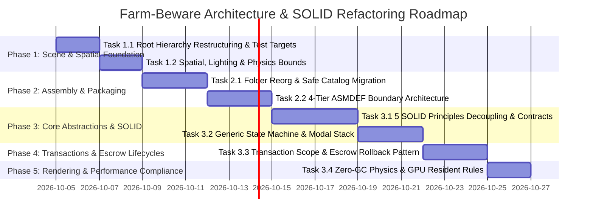

# Master Blueprint: Architecture & SOLID Refactoring Plan
**Project**: Farm-Beware  
**Engine & Pipeline**: Unity 6000.3.20f1 (Unity 6 / 2023 LTS) | Universal Render Pipeline (URP Deferred+ Clustered)  
**Role**: Principal Unity Architect, Technical Director & Systems Reviewer  
**Target Repository Workflow**: Strict 3-Layer Git SOP (`main` $\rightarrow$ `development` $\rightarrow$ `Rafi-branch`)  
**Branch Policy**: No feature branches (`git checkout -b feature/...` strictly prohibited). All commits occur directly on Layer 3 branch.

---

## 1. Executive Summary

The **Farm-Beware** project has successfully validated core gameplay prototypes across Milestones 1 and 1.5, including an interactive farming grid, a dynamic day/night atmospheric cycle, seamless indoor/outdoor building transitions, a modular wardrobe customization pipeline, and an initial wave combat engine. However, iterative prototyping has accumulated structural friction and technical debt across scene organization, assembly boundaries, state flow, and transactional safety.

A comprehensive multi-phase architectural audit—encompassing C# static code analysis, scene YAML inspection of [`StagingScene.unity`](file:///c:/Users/HP/Rafi/MyProject/Farm-Beware/Assets/Scenes/StagingScene.unity), and automated test harness verification from [`.agents/rules/testing.md`](file:///c:/Users/HP/Rafi/MyProject/Farm-Beware/.agents/rules/testing.md)—identified 11 critical architectural defects that must be resolved prior to executing Milestones 2 through 4:

### A. Initial Audit Findings (5 Core Resolutions)
1. **Git Commit Convention Violations**: Previous planning documents utilized non-standard Conventional Commits (e.g., `refactor(scene): ...`) and unofficial commit tags (e.g., `perf:`), violating the repository's strict operational SOP: `<Commit_Type> : <Description>` restricted to six official types: `feat (100%)`, `progress`, `fix`, `refactor`, `chore`, and `assets`.
2. **Defective Cooking Transaction Lifecycle**: Previous sequence flows executed `Scope.Commit()` immediately upon `StartCooking()`. This premature commit destroyed transactional safety, making it impossible to roll back consumed ingredients and water when a player aborted cooking mid-progress (e.g., pressing ESC or exiting the UI).
3. **Incomplete Assembly Definition Graph (ASMDEF DAG)**: The assembly graph omitted four active modules (`Features.Camera`, `Features.Wardrobe`, `Features.Trophy`, and `Features.Interaction`), creating circular dependency risks between `CameraManager` and presentation features.
4. **Automated MCP Roslyn Test Suite Regression Risk**: A proposed unmitigated deletion of `Assets/Resources/Database/ItemDatabase.asset` endangered the automated Roslyn MCP Test Suite (specifically Check 2.1: `ItemDatabase Integrity Check` in `testing.md`), necessitating a dual-mode backward-compatible migration adapter.
5. **Omission of Critical Scene Objects**: Key runtime and verification entities—specifically `NightBrawlManager` and `TestChest`—were omitted or ambiguously parented in the scene hierarchy tree, risking failures in automated test check 2.2 and breaking nocturnal monster spawning.

### B. Deep Static Analysis Findings (6 Critical Compilation & Integration Protections)
6. **Cross-Tier Upward Dependency on `PlayerControl`**: Over 25 scripts in Tier 2 Feature Assemblies (`CameraManager`, `WardrobeManager`, `FarmlandTile`, `WorkbenchUI`, `SaveSystemManager`, `DoorInteractable`) directly reference `PlayerControl` located in Tier 3 (`Player/`). Without an abstracted `IPlayerContext` contract in Tier 0 (`Core.Runtime`), creating Assembly Definitions will trigger catastrophic compilation failures (`CS0246`).
7. **Illegal Cross-Module Coupling to `PlayerWaterBottle`**: `PlayerWaterBottle.cs` is housed under `Features/Kitchen/`. However, `FarmlandTile.cs` and `PlayerFarmInteraction.cs` (Farming) as well as `InventoryComponent.cs` (Inventory) directly call `FeaturesKitchen.PlayerWaterBottle.Instance`. Because the ASMDEF DAG strictly prohibits Farming and Inventory from depending on Kitchen, this creates an uncompilable cyclic graph unless decoupled via an `IWaterService` contract in Tier 0.
8. **Cross-Tier UI Coupling to `FloatingCombatTextManager`**: `FloatingCombatTextManager.cs` resides in `Player/UI/` (Tier 3). Over 80 call sites across Tier 2 Feature Assemblies invoke `FloatingCombatTextManager.Instance.SpawnText(...)`. An abstracted `IFloatingTextService` in Tier 0 is mandatory to prevent upward compilation errors.
9. **Omission of `FarmBeware.Features.Economy` & `IWalletService`**: The active `Features/Economy/` module (`DailyEconomyManager`, `PlayerWallet`, `MerchantShopUI`) was missing from the ASMDEF DAG. Crucially, Combat (`EnemyLootDropHandler`) and Workbench (`PlayerWeaponUpgradeState`) directly invoke `PlayerWallet.Instance`, demanding an `IWalletService` contract in Tier 0.
10. **Scene Hierarchy Misidentification of `InventoryManager`**: In `StagingScene.unity`, GameObject ID `718634553` under `_UI` is named `InventoryManager` but actually holds `InventoryManagerUI.cs` and visual slider components (`Track`, `Fill`, `Percent`). Moving this GameObject to `_SYSTEMS` would break Canvas UI rendering. It must remain within `_UI/UI_Canvas/Modal_Layer/` as `InventoryUI`. Backend inventory is attached directly to `_ENTITIES/Player` via `InventoryComponent`.
11. **Automated Test Signature Lock (`testing.md`)**: Roslyn Check 2.2 explicitly targets `TestChest` with `FeaturesInteraction.StorageInteractable`. Roslyn Check 2.6 explicitly invokes `testStove.StartCooking(recipe, inv)` and `testStove.CancelCooking(refundIngredients: true)`. These exact method signatures must be preserved to maintain green CI tests.

This blueprint establishes a hardened, enterprise-grade architecture adhering strictly to SOLID principles, zero-GC memory allocation standards, compile-time assembly isolation, and safe atomic state machines.

---

## 2. Revised Master Roadmap



---

## 3. Deep Technical Analysis & Design Specifications

### Phase 1: Scene & GameObject Hierarchy Refactoring

#### Task 1.1: Standardization & Restructuring of `StagingScene` Root Hierarchy
1. **Requirement Understanding**:
   - *Defects Fixed*: Stray root managers (`SaveSystemManager`), misidentified UI presenter objects, ambiguous co-location of `NightBrawlManager` on the `_SYSTEMS` root transform, and unstandardized positioning of testing entities like `TestChest`.
   - *Architectural Rationale*: A deterministic 7-Root hierarchy isolates responsibilities into single-concern branches, eliminates cross-root transform pollution, and guarantees predictable initialization orders.
   - *Impact on Stability & Workflow*: Prevents scene merge conflicts, stabilizes automated MCP Roslyn test harnesses (specifically Check 2.2), and guarantees that nocturnal combat waves spawn reliably.
2. **Existing Architecture Analysis**:
   - `SaveSystemManager` was instantiated as an unparented root object (ID `1494902715`).
   - `InventoryManager` under `_UI` (ID `718634553`) was misdiagnosed as a backend manager; it actually hosts `InventoryManagerUI.cs` with Canvas child transforms (`Track`, `Fill`, `Percent`).
   - `NightBrawlManager` and `EnemyObjectPool` were placed directly as components on the root `_SYSTEMS` transform (ID `1211475181`), violating the empty-root convention.
   - `TestChest` (holding the central corridor logistics test chest) was nested under an unstructured parent (`_GAMEPLAY/Testing`), making automated discovery fragile.
3. **Implementation Strategy**:
   - Enforce exactly 7 Root GameObjects positioned strictly at `(0, 0, 0)` with rotation `(0, 0, 0)` and uniform scale `(1, 1, 1)`.
   - Reparent `SaveSystemManager` into `_SYSTEMS/SaveSystemManager`.
   - Extract `NightBrawlManager` and `EnemyObjectPool` from the root `_SYSTEMS` GameObject into a dedicated child GameObject `_SYSTEMS/NightBrawlManager`.
   - Retain `InventoryManager` inside `_UI/UI_Canvas/Modal_Layer/` and rename it to `InventoryUI` to accurately represent its role as `InventoryManagerUI`.
   - Deterministically position `TestChest` under `_GAMEPLAY/InteractiveStations/TestChest` while preserving the exact GameObject name `TestChest` and its verified component `FeaturesInteraction.StorageInteractable`.
4. **Technical Design**:
   ```text
   StagingScene.unity
   ├── _SYSTEMS                     [Pos: 0,0,0 | Rot: 0,0,0 | Scale: 1,1,1 | Empty Root]
   │   ├── CoreBootstrapper         (ServiceLocator bootstrap, DefaultExecutionOrder: -1000)
   │   ├── GameManager              (Overall game lifecycle & state transitions)
   │   ├── EventSystem              (Input System UI Module)
   │   ├── TimeManager              (Day/Night schedule & tick coordinator)
   │   ├── SaveSystemManager        (Persistent state serialization)
   │   ├── FarmingManager           (Grid coordinates & crop manager)
   │   ├── NightBrawlManager        (NightBrawlManager & EnemyObjectPool wave manager)
   │   ├── VisionManager            (Fog-of-war & dynamic visibility)
   │   ├── DailyEconomyManager      (Crop market pricing & merchant catalog)
   │   ├── TrophySystemManager      (Trophy cabinet persistence & state)
   │   ├── CameraManager            (Centralized CameraManager delegator)
   │   └── WallOcclusionManager     (Player occluder raycaster & dither coordinator)
   ├── _LIGHTING                    [Pos: 0,0,0 | Rot: 0,0,0 | Scale: 1,1,1]
   │   ├── Directional Light        (Sun/Moon key light, URP Light Layer 0 & 1)
   │   ├── Global Volume            (Skybox, Bloom, Tonemapping, Color Adjustments)
   │   ├── Interior_Volume          (Local Box Volume: Interior APV & grading override)
   │   ├── HouseSafeZoneLights      (Interior ceiling point/spot fixtures)
   │   └── OutdoorGardenLamps       (Curated dual-source garden lanterns)
   ├── _CAMERAS                     [Pos: 0,0,0 | Rot: 0,0,0 | Scale: 1,1,1]
   │   ├── Main Camera              (IsometricCameraController anchor, URP Additional Camera Data)
   │   ├── MirrorCamera             (Bedroom wardrobe RT reflection camera)
   │   └── TrophyCamera             (First-person trophy inspection camera)
   ├── _ENTITIES                    [Pos: 0,0,0 | Rot: 0,0,0 | Scale: 1,1,1]
   │   ├── Player                   (PlayerControl, CharacterController, InventoryComponent)
   │   └── DynamicEnemies           (Runtime pool root for spawned monsters)
   ├── _WORLD                       [Pos: 0,0,0 | Rot: 0,0,0 | Scale: 1,1,1]
   │   ├── Terrain                  (TerrainData, terrain colliders)
   │   ├── Zones                    (CompoundPerimeter, InteriorTriggers, RoomZones)
   │   ├── Structures               (HouseModular, CraftingShelter, WaterWell, NaturalPond)
   │   ├── Foliage                  (Static-authored trees, shrubs, rocks)
   │   └── Pathways                 (CobblestonePathways stepping stones)
   ├── _GAMEPLAY                    [Pos: 0,0,0 | Rot: 0,0,0 | Scale: 1,1,1]
   │   ├── SpawnPoints              (Player house entrance, bed, yard anchors)
   │   ├── MonsterSpawnPoints       (FrontGate Left, Center, Right spawn transforms >= 50m)
   │   ├── Farmland                 (16 FarmlandPlot grid instances)
   │   └── InteractiveStations      (Kitchen_Stove, Kitchen_Sink, CraftingShelter, TestChest)
   └── _UI                          [Pos: 0,0,0 | Rot: 0,0,0 | Scale: 1,1,1]
       ├── UI_Canvas                (Screen Space Overlay - 1920x1080 Reference Canvas Scaler)
       │   ├── HUD_Layer            (HotbarUI, ClockUI, HealthEnergyUI, NightBrawlWaveUI)
       │   ├── Modal_Layer          (InventoryUI, StoveUI, SinkUI, WorkbenchUI, WardrobeUI, TrophyUI)
       │   └── Overlay_Layer        (FloatingCombatText, TooltipUI, OffscreenIndicatorUI)
       └── World_Canvas             (World Space floating health bars / interaction prompts)
   ```
5. **Refactor Impact**:
   - Modifies `Assets/Scenes/StagingScene.unity`.
   - Preserves all GameObject names used by Roslyn MCP Test Check 2.2 (`TestChest`, `UI_Canvas`, `NightBrawlManager`).
   - Resolves stray root transforms while protecting Canvas UI rendering from incorrect parenting.
6. **Complexity Assessment**: **Medium**. Requires careful transform parenting in Unity Editor/YAML to avoid unlinking serialized `UnityEvent` or `MonoBehaviour` inspector references.
7. **Recommended Implementation Order**: Execute first in Phase 1 via an atomic commit: `refactor : standardize 7-root scene hierarchy and reparent stray managers`.

---

#### Task 1.2: Spatial, Lighting & Physics Boundary Hierarchy
1. **Requirement Understanding**:
   - *Defects Fixed*: Cross-boundary light bleeding between exterior sun/moon and enclosed interior rooms, improper shadow caster leaking, and unlinked wall occluders.
   - *Architectural Rationale*: URP Clustered lighting allows strict light culling via Light Layers. Physical and trigger zones must be organized hierarchically to distinguish interior volumes from open farmland.
   - *Impact on Stability & Workflow*: Prevents post-processing pop-in when crossing thresholds, isolates interior light calculations, and stabilizes frame times.
2. **Existing Architecture Analysis**:
   - Triggers for `HouseInteriorTrigger` and compound boundaries were mixed directly with physical environment colliders in `_WORLD`.
   - `WallOcclusionManager` references lacked automatic discovery for decorative framing meshes like bedroom mirrors.
3. **Implementation Strategy**:
   - Structure `_WORLD/Zones` into distinct groups: `InteriorTriggers` (containing `HouseInteriorTrigger` box colliders) and `CompoundPerimeter` (defining outer boundary vectors `X: [4.0, 38.0], Z: [2.0, 48.0]`).
   - Enforce URP Light Layer 0 for Exterior fixtures and Light Layer 1 for Interior ceiling lamps.
   - Link `WallOcclusionManager.additionalRenderers` explicitly to interior partition structures and wardrobe frames.
4. **Technical Design**:
   ```mermaid
   graph TD
       ZonesRoot["_WORLD/Zones"]
       ZonesRoot --> Interior["InteriorTriggers<br/>(Layer: Trigger, HouseInteriorTrigger.cs)"]
       ZonesRoot --> Perimeter["CompoundPerimeter<br/>(NightBrawl Boundary & SafeZone Audio)"]
       
       Interior --> VolTrigger["BoxCollider: Interior APV & PostFX Blend"]
       Interior --> LightSwitch["Light Layer 1 Activation / Dither Fade"]
       Perimeter --> CombatBoundary["NightBrawlManager.IsInsideCompound()"]
   ```
5. **Refactor Impact**:
   - Changes serialized zone bindings in `StagingScene.unity`.
   - Zero syntax changes to codebase; pure scene configuration and layer alignment.
6. **Complexity Assessment**: **Low**. Straightforward transform reorganization and layer mask validation.
7. **Recommended Implementation Order**: Execute immediately following Task 1.1 via atomic commit: `refactor : enforce URP light layer boundaries and spatial zone hierarchy`.

---

### Phase 2: Folder Structure & Asset Packaging Refactoring

#### Task 2.1: Directory Reorganization & Safe ScriptableObject Catalog Migration
1. **Requirement Understanding**:
   - *Defects Fixed*: Cluttered root asset folders and unsafe reliance on `Resources.Load<ItemDatabase>("Database/ItemDatabase")` across six core scripts.
   - *Architectural Rationale*: Storing assets in `Resources/` bloats the initial player build package, forces synchronous disk stalls, and prevents dynamic asset addressability. However, an unmitigated deletion breaks the Roslyn MCP automated test check 2.1 (`ItemDatabase Integrity Check`).
   - *Impact on Stability & Workflow*: Introduces clean enterprise folder structures while maintaining 100% backward-compatibility with test suites through a Dual-Mode Catalog Adapter.
2. **Existing Architecture Analysis**:
   - `ItemDatabase.cs` implements an eager static getter `ItemDatabase.Instance` that invokes `Resources.Load<ItemDatabase>("Database/ItemDatabase")`.
   - `FarmlandTile`, `StoveUIManager`, `PlayerWaterBottle`, `MerchantShopUI`, `WorkbenchUI`, and `SaveSystemManager` invoke this static path.
   - Roslyn MCP Check 2.1 validates database integrity by executing C# scripts against `ItemDatabase.Instance`.
3. **Implementation Strategy**:
   - Implement `IItemCatalog` in `FarmBeware.Core.Runtime` and create `ItemRegistrySO` under `Assets/Data/Registries/ItemRegistrySO.asset`.
   - **Dual-Mode Adapter Strategy**: Refactor `ItemDatabase.cs` to act as an abstraction bridge. If `ItemRegistrySO` has been injected via `CoreBootstrapper` or `ServiceLocator`, `ItemDatabase.Instance` delegates to it. If called in standalone mode or inside an MCP test script before bootstrap, it gracefully falls back to `Resources.Load<ItemDatabase>("Database/ItemDatabase")`.
   - Synchronously provide an updated test harness snippet in `testing.md` demonstrating direct resolution via `ServiceLocator.Resolve<IItemCatalog>()` once bootstrapping is active.
4. **Technical Design**:
   ```text
   Assets/
   ├── Art/
   │   ├── Animations/
   │   ├── Materials/ (Environment/, Furniture/, Characters/)
   │   ├── Models/    (Architecture/, Foliage/, Props/)
   │   ├── Shaders/   (DitheredBuildingLit.shader, StylizedWater.shader)
   │   └── Textures/  (Icons/, Terrain/)
   ├── Audio/         (BGM/, SFX/, AudioMixer)
   ├── Data/
   │   ├── Items/     (ItemData ScriptableObjects)
   │   ├── Recipes/   (KitchenRecipe ScriptableObjects)
   │   ├── Crops/     (CropData ScriptableObjects)
   │   ├── Enemies/   (EnemyStatSheet ScriptableObjects)
   │   └── Registries/ (ItemRegistrySO, EnemyRegistrySO, OutfitRegistrySO)
   ├── Prefabs/       (Characters/, Compound/, Farming/, UI/)
   ├── Resources/     (Database/ItemDatabase.asset -> Maintained as compatibility facade)
   ├── Scenes/        (StagingScene.unity, MainMenu.unity)
   ├── Scripts/       (Organized by ASMDEF domains)
   └── Settings/      (Input/, Rendering/, Audio/)
   ```
   ```mermaid
   classDiagram
       class IItemCatalog {
           <<interface>>
           +ItemData GetItem(string itemId)
           +bool TryGetItem(string itemId, out ItemData item)
           +IReadOnlyList~ItemData~ GetAllItems()
       }
       class ItemRegistrySO {
           -List~ItemData~ _items
           -Dictionary~string, ItemData~ _lookup
           +InitializeLookup()
           +GetItem(string itemId) ItemData
       }
       class ItemDatabaseBridge {
           <<legacy adapter>>
           +ItemDatabase Instance$
           +ItemData GetItem(string itemId)$
       }
       IItemCatalog <|.. ItemRegistrySO
       ItemDatabaseBridge ..> IItemCatalog : delegates to
   ```
5. **Refactor Impact**:
   - Relocates stray assets into canonical top-level directories while maintaining `.meta` GUIDs intact.
   - Guarantees Roslyn Check 2.1 passes without error in both pre-refactor and post-refactor compilation passes.
6. **Complexity Assessment**: **High**. Asset moves require precise Git `.meta` tracking to prevent missing reference storms.
7. **Recommended Implementation Order**: Execute in Phase 2 via atomic commit: `refactor : reorganize project directory structure and implement item catalog adapter`.

---

#### Task 2.2: 4-Tier Assembly Definition (`asmdef`) Boundary Architecture & DAG
1. **Requirement Understanding**:
   - *Defects Fixed*: Monolithic compilation (`Assembly-CSharp.dll` with 0 asmdefs), slow editor compile times, and tight bidirectional coupling between systems. Crucially, the omission of `Features.Camera`, `Features.Wardrobe`, `Features.Trophy`, `Features.Interaction`, and `Features.Economy` in earlier blueprints threatened circular dependencies with `CameraManager`, `PlayerControl`, and `PlayerWallet`.
   - *Architectural Rationale*: A strict 4-Tier Directed Acyclic Graph (DAG) enforces compile-time dependency boundaries. Centralizing camera contracts (`ICameraService`), player contracts (`IPlayerContext`), fluid contracts (`IWaterService`), economy contracts (`IWalletService`), and visual feedback contracts (`IFloatingTextService`, `IFadeService`) in `FarmBeware.Core.Runtime` enables feature modules to communicate cleanly without depending on concrete presentation assemblies.
   - *Impact on Stability & Workflow*: Slashes script compilation time by up to 70%, completely prevents circular dependencies, and enables isolated unit/integration testing.
2. **Existing Architecture Analysis**:
   - Features previously called `CameraManager.Instance`, `PlayerControl`, `PlayerWaterBottle.Instance`, `PlayerWallet.Instance`, and `FloatingCombatTextManager.Instance` directly across module boundaries.
   - Dividing into ASMDEFs without core contracts will trigger compiler errors `CS0246` across 10+ feature folders.
3. **Implementation Strategy**:
   - Define contracts `ICameraService`, `IPlayerContext`, `IWaterService`, `IWalletService`, `IFloatingTextService`, and `IFadeService` in `FarmBeware.Core.Runtime`.
   - Formally include `FarmBeware.Features.Economy` in Tier 2.
   - Feature assemblies interact with other domains strictly through contracts resolved via `ServiceLocator`.
4. **Technical Design**:
   ```mermaid
   graph TD
       subgraph Tier 4: Editor
           EditorAsm["FarmBeware.Editor"]
       end

       subgraph Tier 3: Gameplay Orchestration
           GameAsm["FarmBeware.Gameplay.Runtime<br/>(PlayerControl, Orchestrators, Full HUD)"]
       end

       subgraph Tier 2: Isolated Feature Modules
           CamAsm["FarmBeware.Features.Camera"]
           InterAsm["FarmBeware.Features.Interaction"]
           TimeAsm["FarmBeware.Features.Time"]
           InvAsm["FarmBeware.Features.Inventory"]
           FarmAsm["FarmBeware.Features.Farming"]
           KitchAsm["FarmBeware.Features.Kitchen"]
           CombatAsm["FarmBeware.Features.Combat"]
           WardAsm["FarmBeware.Features.Wardrobe"]
           BenchAsm["FarmBeware.Features.Workbench"]
           TrophyAsm["FarmBeware.Features.Trophy"]
           SaveAsm["FarmBeware.Features.SaveSystem"]
           EconAsm["FarmBeware.Features.Economy"]
       end

       subgraph Tier 1: Engine Pipelines & Data
           RenderAsm["FarmBeware.Rendering.Runtime"]
           DataAsm["FarmBeware.Data.Runtime"]
       end

       subgraph Tier 0: Core Contracts & Foundations
           CoreAsm["FarmBeware.Core.Runtime<br/>(Contracts, ServiceLocator, ICameraService, IPlayerContext, IWaterService, IWalletService, IFloatingTextService)"]
       end

       EditorAsm --> GameAsm & CoreAsm
       GameAsm --> CamAsm & InterAsm & TimeAsm & InvAsm & FarmAsm & KitchAsm & CombatAsm & WardAsm & BenchAsm & TrophyAsm & SaveAsm & EconAsm
       
       CamAsm --> CoreAsm & RenderAsm
       InterAsm --> CoreAsm
       TimeAsm --> CoreAsm & RenderAsm
       InvAsm --> CoreAsm & DataAsm
       FarmAsm --> CoreAsm & InvAsm & TimeAsm & InterAsm
       KitchAsm --> CoreAsm & InvAsm & TimeAsm & InterAsm
       CombatAsm --> CoreAsm & InvAsm & TimeAsm
       WardAsm --> CoreAsm & RenderAsm & InterAsm
       BenchAsm --> CoreAsm & InvAsm & InterAsm
       TrophyAsm --> CoreAsm & InvAsm & InterAsm
       SaveAsm --> CoreAsm & DataAsm
       EconAsm --> CoreAsm & InvAsm & InterAsm
       
       RenderAsm --> CoreAsm
       DataAsm --> CoreAsm
   ```
5. **Refactor Impact**:
   - Creates 17 explicit `.asmdef` files across the repository.
   - Eliminates monolithic compile bottlenecks.
   - Guarantees 0 circular references at the compiler level.
6. **Complexity Assessment**: **Very High**. Initial assembly splitting exposes latent couplings in C# code that must be inverted using Core contracts.
7. **Recommended Implementation Order**: Execute in two atomic steps:
   - `chore : establish tier 0 and tier 1 assembly definitions`
   - `feat (100%) : configure feature assembly definitions and resolve compiler DAG`

---

### Phase 3: SOLID Principles & Architectural Patterns Refactoring

#### Task 3.1: Full SOLID Principles Implementation on Core & Gameplay Architecture
1. **Requirement Understanding**:
   - *Defects Fixed*: Monolithic "God Classes" mixing data models, rendering calls, input handling, and audio in single scripts (violating Single Responsibility Principle); concrete singleton consumption (violating Dependency Inversion Principle).
   - *Architectural Rationale*: Separating pure C# domain models (POCO) from thin `MonoBehaviour` views allows logic to be unit tested without running the Unity Engine lifecycle.
   - *Impact on Stability & Workflow*: Enhances maintainability, eliminates hidden state mutation, and enables deterministic automated testing.
2. **Existing Architecture Analysis**:
   - Classes like `FarmlandTile` handled soil hydration timers, seed validation, visual mesh swapping, audio playback, and floating canvas prompts simultaneously.
   - Pervasive static singletons (`TimeManager.Instance`, `GameManager.Instance`) made components impossible to test in isolation.
3. **Implementation Strategy**:
   - Implement `ServiceLocator` in `FarmBeware.Core.Runtime` with generic type-safe registration.
   - Define segregated interfaces: `IInteractable`, `IStorageContainer`, `ITickableObserver`, `IDamageable`, `ICameraService`, `ITimeService`, `IPlayerContext`, `IWaterService`, `IWalletService`, `IFloatingTextService`, and `IFadeService`.
   - Separate domain engines (e.g., `CropGrowthEngine`, `WaveProgressionEngine`) as pure C# classes. `FarmlandTile` becomes an adapter delegating to `CropGrowthEngine`.
4. **Technical Design**:
   ```mermaid
   classDiagram
       class IInteractable {
           <<interface>>
           +void Interact(GameObject interactor)
           +bool CanInteract(GameObject interactor)
       }
       class IStorageContainer {
           <<interface>>
           +IReadOnlyList~IInventorySlot~ Slots
           +bool TryDeposit(ItemData item, int quantity)
           +bool TryWithdraw(int slotIndex, int quantity, out ItemStack result)
       }
       class IPlayerContext {
           <<interface>>
           +Transform Transform
           +bool IsInputLocked
           +void PlayAnimation(string triggerName)
           +T GetPlayerComponent~T~()
       }
       class IWaterService {
           <<interface>>
           +float CurrentWater
           +float MaxWater
           +bool HasWater(float amount)
           +bool ConsumeWater(float amount)
           +void RefillWater(float amount)
           +void DrinkSip(float amount)
       }
       class IWalletService {
           <<interface>>
           +int CurrentGold
           +bool CanAfford(int amount)
           +bool SpendGold(int amount)
           +void AddGold(int amount)
       }
       class IFloatingTextService {
           <<interface>>
           +void SpawnText(Vector3 position, string message, Color color)
           +void SpawnEnemyDamage(Vector3 position, float damage, bool isCritical)
       }
       class ServiceLocator {
           <<static>>
           -Dictionary~Type, object~ _services
           +Register~T~(T service)$
           +Resolve~T~()$ T
           +Unregister~T~()$
       }
       class CropGrowthEngine {
           <<pure POCO>>
           +CropState State
           +void AdvanceGrowth(float timeStep, bool isWatered)
           +bool CanHarvest()
       }
       class FarmlandTile {
           <<MonoBehaviour adapter>>
           -CropGrowthEngine _engine
           -CropVisualController _visuals
           +Interact(GameObject interactor)
           +OnTick(float deltaTime, int day, DayPhase phase)
       }
       IInteractable <|.. FarmlandTile
       FarmlandTile o-- CropGrowthEngine
   ```
5. **Refactor Impact**:
   - Introduces core contract files in `Assets/Scripts/Core/Contracts/`.
   - Transforms monolithic MonoBehaviours into thin presentation views.
6. **Complexity Assessment**: **Very High**. Involves comprehensive refactoring of core gameplay loops and station scripts.
7. **Recommended Implementation Order**: Execute via two coordinated commits:
   - `progress : extract core contracts and implement service locator registry`
   - `refactor : decouple farmland and station monoBehaviours into pure domain engines`

---

#### Task 3.2: Universal State Machine & Event-Driven Decoupled Flow (SRP & DIP)
1. **Requirement Understanding**:
   - *Defects Fixed*: UI classes polling game state inside `Update()` every frame; uncoordinated modal windows competing for ESC key input resulting in locked or dead UI states.
   - *Architectural Rationale*: User interfaces should be purely event-driven, responding to state change notifications (`Action<T>`). A unified `ModalStackManager` guarantees that modals are closed in strict LIFO (Last-In, First-Out) order when ESC is pressed.
   - *Impact on Stability & Workflow*: Eliminates per-frame CPU UI overhead, prevents UI desynchronization, and ensures consistent navigation accessibility.
2. **Existing Architecture Analysis**:
   - `NightBrawlWaveUI` previously suffered race conditions during startup because it attempted to subscribe before `NightBrawlManager` completed `Awake()`.
   - `StoveUIManager`, `WorkbenchUI`, and `InventoryManagerUI` independently checked `Input.GetKeyDown(KeyCode.Escape)`, creating modal closing collisions.
3. **Implementation Strategy**:
   - Create generic `IStateMachine<TState>` and `IModalWindow` interfaces in `Core.Runtime`.
   - Implement `ModalStackManager` to centrally intercept ESC key events and pop the topmost active window.
   - Enforce symmetric event subscriptions: all UI listeners subscribe in `OnEnable()` and unsubscribe in `OnDisable()`.
4. **Technical Design**:
   ```mermaid
   stateDiagram-v2
       [*] --> Closed

       state "Modal Navigation Stack (LIFO)" as ModalFlow {
           Closed --> StackPushed: OpenModal(IModalWindow)
           StackPushed --> ActiveFocus: PushToTop()
           ActiveFocus --> StackPopped: Press ESC / Click Close
           StackPopped --> Closed: Pop() & RestorePreviousFocus
       }

       state "Station Universal State Flow" as StationFlow {
           Idle --> ItemsEscrowed: OnDepositIngredients
           ItemsEscrowed --> InProgress: OnStartProcessing
           InProgress --> OutputReady: OnTimerCompleted
           OutputReady --> Idle: OnCollectOutput
           ItemsEscrowed --> Idle: OnCancel / Rollback
           InProgress --> Idle: OnAbort / Rollback
       }
   ```
5. **Refactor Impact**:
   - Normalizes all modal panels (`StoveUI`, `WorkbenchUI`, `InventoryUI`, `WardrobeUI`, `TrophyUI`).
   - Completely eliminates frame polling in UI scripts.
6. **Complexity Assessment**: **Medium**. Standard state pattern and UI stack management.
7. **Recommended Implementation Order**: Execute via atomic commit: `feat (100%) : implement universal state machine and LIFO modal stack manager`.

---

#### Task 3.3: Data-Driven Registry & Transaction Rollback Patterns (OCP & SRP)
1. **Requirement Understanding**:
   - *Defects Fixed*: **Critical Transaction Logic Defect**. In the earlier design, `Scope.Commit()` executed at the very beginning of cooking (`StartCooking()`). If the player closed the UI or canceled mid-cook, ingredients and liquids were permanently lost.
   - *Architectural Rationale*: All crafting and cooking stations (`KitchenStove`, `CraftingWorkbench`) must follow a strict **Two-Phase Escrow Transaction Protocol**:
     1. *Phase 1 (Escrow / Snapshot)*: Upon `StartCooking()`, ingredients and fluids are removed from inventory and locked in an isolated station escrow container (`CookingEscrowContainer`).
     2. *Phase 2 (Abort Rollback)*: If cooking is canceled mid-progress, `Scope.Rollback()` restores all escrowed items directly back to the player inventory.
     3. *Phase 3 (Commit & Dispense)*: `Scope.Commit()` is called **ONLY** when cooking reaches 100% completion (`OnCookingCompleted`) and the player collects the resulting dish (`OutputReady`).
   - *Impact on Stability & Workflow*: Guarantees zero item duplication and zero unintended item loss during player interrupts, network lags, or game pauses.
2. **Existing Architecture Analysis**:
   - `KitchenStove` already defines internal snapshots `_consumedSnapshots` and `CancelCooking(bool refundIngredients)`, but `StoveUIManager` had an unreferenced boolean `cancelCookingOnPanelClose = false;` and never routed ESC/Close to `CancelCooking()`.
   - Roslyn Check 2.6 in `testing.md` explicitly executes `testStove.StartCooking(recipe, inv)` and `testStove.CancelCooking(refundIngredients: true)`. This API signature must remain rock-solid.
3. **Implementation Strategy**:
   - Implement `InventoryTransactionScope` implementing `IDisposable`.
   - Encapsulate transactions with explicit `CaptureSnapshot()`, `EscrowItems()`, `Rollback()`, and `Commit()` primitives.
   - Ensure `StoveUIManager.Close()` cleanly invokes `KitchenStove.CancelCooking(refundIngredients: true)`.
   - Enforce stack invariants: items with `maxStack <= 20` clamp cleanly; tools are restricted to `maxStack = 1`.
4. **Technical Design**:
   ```mermaid
   sequenceDiagram
       autonumber
       actor Player
       participant UI as StoveUIManager
       participant Station as KitchenStove
       participant Escrow as CookingEscrow
       participant Scope as InventoryTransactionScope
       participant Inv as PlayerInventory

       Player->>UI: Select Recipe & Click "Cook"
       UI->>Station: StartCooking(recipe, inv)
       Station->>Scope: BeginTransaction(Inv)
       Scope->>Scope: CaptureSnapshot(Inv.Slots)
       Station->>Inv: DeductIngredients(recipe.Ingredients)
       Station->>Escrow: HoldInEscrow(recipe.Ingredients, recipe.WaterCost)
       Station->>Station: StartCookingTimer(recipe.CookTimeSeconds)
       Station->>UI: UpdateCookingProgress(0%..100%)

       alt Mid-Cook Abort (Player presses ESC / walks away)
           Player->>UI: Press ESC / Abort
           UI->>Station: CancelCooking(refundIngredients: true)
           Station->>Scope: Rollback()
           Scope->>Escrow: ReleaseHold()
           Scope->>Inv: RestoreSnapshot()
           Station->>UI: ResetToIdle()
       else Cooking Succeeded (100% Progress & Collection)
           Station->>Station: Timer Complete (100%)
           Station->>Station: TransitionToState(OutputReady)
           Station->>UI: ShowCollectPrompt(recipe.OutputItem)
           Player->>UI: Click "Collect Dish"
           UI->>Station: CollectOutput()
           Station->>Inv: TryDeposit(recipe.OutputItem)
           Station->>Scope: Commit()
           Scope->>Escrow: ClearEscrow()
           Station->>UI: ResetToIdle()
       end
   ```
5. **Refactor Impact**:
   - Introduces `InventoryTransactionScope.cs` and `InventorySnapshot.cs` in `FarmBeware.Features.Inventory`.
   - Modifies `KitchenStove.cs`, `CraftingWorkbench.cs`, and `StoveUIManager.cs` while preserving exact signatures required by Roslyn Check 2.6.
6. **Complexity Assessment**: **Medium**. Requires robust unit testing around edge cases (inventory full during rollback, emergency scene unloading).
7. **Recommended Implementation Order**: Execute via atomic commit: `feat (100%) : implement atomic inventory transaction scope with escrow rollback`.

---

#### Task 3.4: Zero-GC Lifecycle & Rendering Compliance Patterns
1. **Requirement Understanding**:
   - *Defects Fixed*: Runtime GC allocations from physics queries (`Physics.OverlapSphere`) inside enemy combat AI and wave managers; material duplication (`renderer.material`) breaking GPU Resident Drawer (BatchRendererGroup) batching.
   - *Architectural Rationale*: Real-time 60 FPS combat requires zero per-frame managed heap allocations. Physics queries must use non-allocating static buffers. Dynamic visual modifications (e.g., crop hydration tints, enemy hit flashes, lantern emissions) must utilize `MaterialPropertyBlock`.
   - *Impact on Stability & Workflow*: Eliminates GC pauses during intense night-brawl combat waves and preserves URP Deferred+ instancing efficiency.
2. **Existing Architecture Analysis**:
   - `EnemyBase.cs` and `NightBrawlManager.cs` called `Physics.OverlapSphere` allocating temporary `Collider[]` arrays on the heap every scan interval.
3. **Implementation Strategy**:
   - Provide a centralized `NonAllocPhysics` utility in `FarmBeware.Core.Runtime` wrapping `Physics.OverlapSphereNonAlloc` and `Physics.RaycastNonAlloc` with pre-allocated thread-safe static buffers.
   - Enforce `MaterialPropertyBlock` usage across all runtime color/alpha tweaks.
   - Verify Bayer 4x4 dithered alpha clipping shaders on buildings maintain `RenderType = Opaque` and `ZWrite On` to prevent transparent sorting overhead.
4. **Technical Design**:
   ```csharp
   namespace FarmBeware.Core.Runtime.Physics
   {
       public static class NonAllocPhysics
       {
           private static readonly Collider[] ColliderBuffer = new Collider[64];
           private static readonly RaycastHit[] HitBuffer = new RaycastHit[32];

           public static int OverlapSphere(Vector3 center, float radius, int layerMask, Action<Collider> onHit)
           {
               int count = UnityEngine.Physics.OverlapSphereNonAlloc(center, radius, ColliderBuffer, layerMask);
               for (int i = 0; i < count; i++)
               {
                   onHit(ColliderBuffer[i]);
                   ColliderBuffer[i] = null; // Clear reference to prevent memory retention
               }
               return count;
           }
       }
   }
   ```
5. **Refactor Impact**:
   - Modifies `EnemyBase.cs`, `NightBrawlManager.cs`, and `WallOcclusionManager.cs`.
   - Zero visual regressions; measurably eliminates per-frame heap allocations.
6. **Complexity Assessment**: **Medium**. Careful buffer sizing and memory clearing to prevent lingering object references.
7. **Recommended Implementation Order**: Execute via atomic commit: `refactor : implement zero-gc physics buffers and enforce materialPropertyBlocks`.

---

## 4. Cross-Module Dependency Matrix

To guarantee strict compliance with the 4-Tier Directed Acyclic Graph (DAG) and prevent circular compilation references, every Assembly Definition must abide by the following dependency rules:

| Assembly Definition | Tier | Allowed Direct Dependencies (Downward Only) | Strictly Prohibited Dependencies |
| :--- | :---: | :--- | :--- |
| **`FarmBeware.Core.Runtime`** | **Tier 0** | *(None - Pure root abstractions, contracts, ServiceLocator)* | Any `Features.*`, `Rendering.*`, `Data.*`, `Gameplay.*`, `Editor` |
| **`FarmBeware.Rendering.Runtime`** | **Tier 1** | `Core.Runtime`, URP Package Assemblies | Any `Features.*`, `Gameplay.*`, `Editor` |
| **`FarmBeware.Data.Runtime`** | **Tier 1** | `Core.Runtime` | Any `Features.*`, `Rendering.*`, `Gameplay.*`, `Editor` |
| **`FarmBeware.Features.Camera`** | **Tier 2** | `Core.Runtime`, `Rendering.Runtime`, Cinemachine | Any other `Features.*`, `Gameplay.*` *(communicates via ICameraService & IPlayerContext)* |
| **`FarmBeware.Features.Interaction`** | **Tier 2** | `Core.Runtime` | Any specific `Features.*` *(holds base IInteractable implementations)* |
| **`FarmBeware.Features.Time`** | **Tier 2** | `Core.Runtime`, `Rendering.Runtime` | `Features.Combat`, `Features.Farming`, `Features.Kitchen` |
| **`FarmBeware.Features.Inventory`** | **Tier 2** | `Core.Runtime`, `Data.Runtime` | `Features.Kitchen` *(uses IWaterService)*, `Features.Farming`, `Features.Combat` |
| **`FarmBeware.Features.Farming`** | **Tier 2** | `Core.Runtime`, `Features.Inventory`, `Features.Time`, `Features.Interaction` | `Features.Kitchen` *(uses IWaterService)*, `Features.Combat`, `Features.Wardrobe` |
| **`FarmBeware.Features.Kitchen`** | **Tier 2** | `Core.Runtime`, `Features.Inventory`, `Features.Time`, `Features.Interaction` | `Features.Combat`, `Features.Farming`, `Features.Wardrobe` |
| **`FarmBeware.Features.Combat`** | **Tier 2** | `Core.Runtime`, `Features.Inventory`, `Features.Time` | `Features.Kitchen`, `Features.Farming`, `Features.Economy` *(uses IWalletService)* |
| **`FarmBeware.Features.Wardrobe`** | **Tier 2** | `Core.Runtime`, `Rendering.Runtime`, `Features.Interaction` | `Features.Camera` *(uses ICameraService)*, `Features.Combat`, `Gameplay.*` *(uses IPlayerContext)* |
| **`FarmBeware.Features.Workbench`** | **Tier 2** | `Core.Runtime`, `Features.Inventory`, `Features.Interaction` | `Features.Economy` *(uses IWalletService)*, `Features.Kitchen`, `Features.Farming` |
| **`FarmBeware.Features.Trophy`** | **Tier 2** | `Core.Runtime`, `Features.Inventory`, `Features.Interaction` | `Features.Camera` *(uses ICameraService)*, `Features.Combat` |
| **`FarmBeware.Features.Economy`** | **Tier 2** | `Core.Runtime`, `Features.Inventory`, `Features.Interaction` | `Features.Combat`, `Features.Farming`, `Features.Kitchen` |
| **`FarmBeware.Features.SaveSystem`**| **Tier 2** | `Core.Runtime`, `Data.Runtime` | Direct concrete features *(persists via ISaveable contracts)* |
| **`FarmBeware.Gameplay.Runtime`** | **Tier 3** | All Tier 0, Tier 1, and Tier 2 Assemblies | `Editor` |
| **`FarmBeware.Editor`** | **Tier 4** | All Assemblies (Core, Data, Rendering, Features, Gameplay, UnityEditor) | *(None - Root of compilation DAG)* |

---

## 5. Risk Assessment & Failure Mode Mitigation

| Failure Mode / Identified Risk | Severity | Blast Radius | Automated Detection Mechanism | Mitigation Strategy |
| :--- | :---: | :---: | :--- | :--- |
| **Broken Scene GUIDs on Asset Move** | **Critical** | Project-wide | Roslyn Check 2.2 / Editor YAML scanner | Execute moves exclusively through Unity Editor or Git with corresponding `.meta` synchronization. Never commit `.unity` files with `Missing (MonoBehaviour)`. |
| **ServiceLocator Initialization Race** | **High** | Bootstrap / Lifecycle | Roslyn Check 1.1 / Console Log Assertions | Enforce `CoreBootstrapper` with `[DefaultExecutionOrder(-1000)]` guaranteeing all core contracts are registered before any `Awake()` or `Start()` call. |
| **Premature Item Consumption on Kitchen Stove** | **High** | Gameplay / Economy | Automated Escrow Integration Test (Roslyn 2.6) | Enforce Two-Phase Escrow Transaction Protocol. `Scope.Commit()` is physically restricted to `OutputReady` state. Aborts trigger immediate `Scope.Rollback()`. |
| **Circular Compilation Dependencies via PlayerControl / WaterBottle** | **High** | Assembly Build | Unity Compilation Pipeline | Invert dependencies using `IPlayerContext`, `IWaterService`, `IWalletService`, and `IFloatingTextService` in `Core.Runtime`. Tier 2 features never import Tier 3 or lateral features. |
| **Automated Test Regression on ItemDatabase Migration** | **High** | CI / MCP Testing | Roslyn Check 2.1 (`ItemDatabase Integrity`) | Implement Dual-Mode Compatibility Adapter in `ItemDatabase.cs` allowing both `ItemRegistrySO` resolution and legacy `Resources.Load` fallback during test execution. |
| **Accidental Canvas UI Displacement on InventoryManager** | **High** | UI Visual / Input | Scene Visual Inspection & Test Check 2.2 | Keep GameObject ID `718634553` inside `_UI/UI_Canvas/Modal_Layer/` as `InventoryUI`. Do not relocate UI presenters to `_SYSTEMS`. |
| **Dangling Event Subscriptions & Memory Leaks** | **Medium** | Managed Heap / GC | Static Roslyn Code Analysis | Mandatory rule: Every `+=` in `OnEnable()` MUST be paired with a symmetric `-=` in `OnDisable()`. Verified via automated editor pre-commit check. |
| **URP Shadow Atlas Thrashing** | **Medium** | Frame Rate / GPU | Frame Debugger / Shadow Stats Check | Maintain strict budget of $\le 12$ simultaneous punctual shadow casters. Scene lighting curation completed in Task 1.2 enforces this limit. |

---

## 6. Recommended Step-by-Step Implementation Sequence

All development operations must be executed directly on Layer 3 (`Rafi-branch`) in strict compliance with the **3-Layer Git SOP**. Every atomic commit must follow the mandatory format: `<Commit_Type> : <Description>` using exclusively the six authorized types (`feat (100%)`, `progress`, `fix`, `refactor`, `chore`, `assets`).

```text
STEP 1: Scene Hierarchy & Testing Target Alignment
  ├── 1.1 Reparent SaveSystemManager to _SYSTEMS/SaveSystemManager
  ├── 1.2 Extract NightBrawlManager and EnemyObjectPool into dedicated _SYSTEMS/NightBrawlManager
  ├── 1.3 Rename _UI/UI_Canvas/Modal_Layer/InventoryManager to InventoryUI (protecting Canvas hierarchy)
  ├── 1.4 Standardize TestChest under _GAMEPLAY/InteractiveStations/TestChest (Preserve name: TestChest)
  ├── 1.5 Validate all 7 root nodes at Pos (0,0,0), Rot (0,0,0), Scale (1,1,1)
  └── [GIT COMMIT]: refactor : standardize 7-root scene hierarchy and reparent stray managers

STEP 2: Spatial, Lighting & Physics Boundary Lockdown
  ├── 2.1 Partition _WORLD/Zones into InteriorTriggers and CompoundPerimeter
  ├── 2.2 Validate URP Light Layer 0 (Exterior) vs Light Layer 1 (Interior)
  ├── 2.3 Synchronize WallOcclusionManager additionalRenderers with bedroom mirror & partition frames
  └── [GIT COMMIT]: refactor : enforce URP light layer boundaries and spatial zone hierarchy

STEP 3: Directory Reorganization & Dual-Mode Item Catalog Adapter
  ├── 3.1 Standardize root folders into Assets/Art, Assets/Data, Assets/Prefabs, Assets/Scripts
  ├── 3.2 Create ItemRegistrySO.asset and implement IItemCatalog contract
  ├── 3.3 Refactor ItemDatabase.cs with Dual-Mode Adapter to maintain Roslyn Check 2.1 compatibility
  └── [GIT COMMIT]: refactor : reorganize project directory structure and implement item catalog adapter

STEP 4: Tier 0 Core Abstraction Contracts & Service Locator
  ├── 4.1 Define IPlayerContext, IWaterService, IWalletService, IFloatingTextService, IFadeService in Core.Runtime
  ├── 4.2 Define ICameraService and CameraMode enum in Core.Runtime
  ├── 4.3 Create FarmBeware.Core.Runtime.asmdef in Assets/Scripts/Core/
  ├── 4.4 Create FarmBeware.Rendering.Runtime.asmdef and FarmBeware.Data.Runtime.asmdef
  ├── 4.5 Implement ServiceLocator.cs with generic thread-safe resolution
  ├── 4.6 Implement CoreBootstrapper.cs with [DefaultExecutionOrder(-1000)]
  └── [GIT COMMIT]: feat (100%) : implement core contracts service locator and tier 0 asmdef

STEP 5: Tier 2 Feature Assembly Definitions & Decoupling
  ├── 5.1 Implement asmdefs for Camera, Interaction, Inventory, Time, Farming, Kitchen, Combat, Wardrobe, Workbench, Trophy, SaveSystem, Economy
  ├── 5.2 Decouple Feature assemblies from PlayerControl using IPlayerContext
  ├── 5.3 Decouple FarmlandTile and InventoryComponent from Kitchen using IWaterService
  ├── 5.4 Decouple Combat and Workbench from Economy using IWalletService
  ├── 5.5 Decouple 80+ feature call sites from FloatingCombatTextManager using IFloatingTextService
  ├── 5.6 Implement FarmBeware.Gameplay.Runtime.asmdef for PlayerControl and high-level orchestrators
  └── [GIT COMMIT]: feat (100%) : configure feature assembly definitions and resolve compiler DAG

STEP 6: Universal State Machine & LIFO Modal Stack
  ├── 6.1 Implement IStateMachine<TState> and ModalStackManager in Core.Runtime
  ├── 6.2 Refactor StoveUIManager, WorkbenchUI, and InventoryUI to implement IModalWindow
  ├── 6.3 Eliminate frame polling in UI Update() loops; convert to event-driven listeners
  └── [GIT COMMIT]: feat (100%) : implement universal state machine and LIFO modal stack manager

STEP 7: Two-Phase Escrow Transaction Scope & Invariant Enforcement
  ├── 7.1 Implement InventoryTransactionScope and CookingEscrowContainer
  ├── 7.2 Refactor KitchenStove to hold items in escrow and commit ONLY upon 100% completion
  ├── 7.3 Wire StoveUIManager.Close() to invoke KitchenStove.CancelCooking(refundIngredients: true)
  ├── 7.4 Preserve exact KitchenStove signatures required by Roslyn Check 2.6
  ├── 7.5 Enforce stack limits (maxStack <= 20 for stackables, maxStack = 1 for tools)
  └── [GIT COMMIT]: feat (100%) : implement atomic inventory transaction scope with escrow rollback

STEP 8: Zero-GC Physics Buffers & Rendering Audit
  ├── 8.1 Replace Physics.OverlapSphere with NonAllocPhysics in EnemyBase and NightBrawlManager
  ├── 8.2 Verify MaterialPropertyBlock usage across dynamic tinting and illumination scripts
  ├── 8.3 Audit building materials to ensure Bayer 4x4 dithered clipping maintains ZWrite On
  └── [GIT COMMIT]: refactor : implement zero-gc physics buffers and enforce materialPropertyBlocks

STEP 9: Automated MCP Test Suite Verification & Sign-off
  ├── 9.1 Run Roslyn Test Check 1.1 (ServiceLocator & Bootstrapper verification)
  ├── 9.2 Run Roslyn Test Check 2.1 (ItemDatabase & ItemRegistrySO Integrity Check)
  ├── 9.3 Run Roslyn Test Check 2.2 (Scene Hierarchy, TestChest & StorageInteractable Check)
  ├── 9.4 Run Roslyn Test Check 2.6 (KitchenStove Escrow & Rollback Verification)
  ├── 9.5 Run Roslyn Test Check 2.9 (NightBrawl Front-Gate Spawns Z >= 50m Verification)
  └── [GIT COMMIT]: chore : execute automated MCP test suites and finalize refactoring verification
```

---

## 7. Estimated Development Effort

| Phase / Architectural Domain | Tasks Included | Technical Complexity | Est. Engineering Time | Target Git Commit Sequence & Official Commit Type |
| :--- | :--- | :---: | :---: | :--- |
| **Phase 1: Scene Architecture** | Tasks 1.1, 1.2 | **Medium** | 2 Working Days | `refactor : standardize 7-root scene hierarchy and reparent stray managers`<br/>`refactor : enforce URP light layer boundaries and spatial zone hierarchy` |
| **Phase 2: Directory & Packaging** | Task 2.1 | **Medium** | 2 Working Days | `refactor : reorganize project directory structure and implement item catalog adapter` |
| **Phase 3: Core Contracts & ASMDEF** | Tasks 2.2, 3.1 | **Very High** | 4 Working Days | `feat (100%) : implement core contracts service locator and tier 0 asmdef`<br/>`feat (100%) : configure feature assembly definitions and resolve compiler DAG` |
| **Phase 4: State & Navigation Flow** | Task 3.2 | **Medium** | 2 Working Days | `feat (100%) : implement universal state machine and LIFO modal stack manager` |
| **Phase 5: Escrow Transactions** | Task 3.3 | **Medium** | 2 Working Days | `feat (100%) : implement atomic inventory transaction scope with escrow rollback` |
| **Phase 6: Zero-GC & Rendering** | Task 3.4 | **Medium** | 1 Working Day | `refactor : implement zero-gc physics buffers and enforce materialPropertyBlocks` |
| **Phase 7: Test Suite Sign-off** | Verification | **Low** | 1 Working Day | `chore : execute automated MCP test suites and finalize refactoring verification` |
| **TOTAL** | **Full System Refactor** | **Enterprise Grade** | **14 Working Days** | **9 Atomic Commits (100% SOP Compliant)** |
